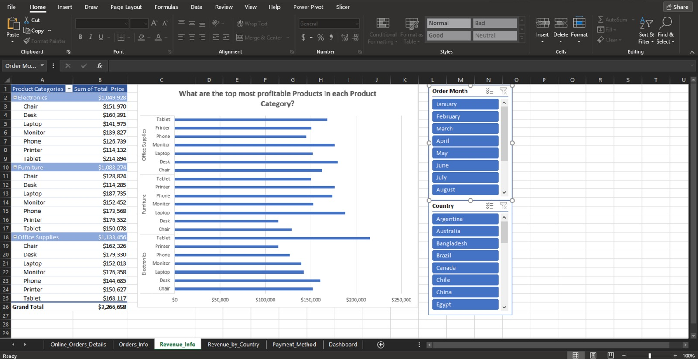

# Online Orders Details – Excel PivotCharts Dashboard (Project 3)

## 📌 Project Overview
This project demonstrates how Excel can be used with **MySQL Database**, **Power Query**, and **PivotCharts** to analyze and visualize online orders data.  

The goal was to design an interactive dashboard focusing on key performance indicators (KPIs) such as product demand, profitability, revenue by country, and payment method usage.  

---

## 🎯 Objectives
- Extract data from a **MySQL Database** using the **Get Data** function in Excel.  
- Perform **data transformation** with Power Query (data types, new columns, transformations).  
- Create multiple **PivotCharts** to answer critical business questions:
  - What are the most ordered products in each category?  
  - What are the most profitable products in each product category?  
  - Which were the **Top 10 Countries** with the most revenue?  
  - Which payment method was used most frequently?  

---

## 🛠️ Tools & Functions Used
- **MySQL Database** (data source)  
- **Excel Get Data** (data import)  

- **Power Query** (data transformation)  

- **PivotCharts & Timelines** (interactive visualizations)  

## 📊 Dashboard Highlights

### 1. Top Products by Orders
PivotChart showing most ordered products in each category, with slicers (Order Month, Country).

### 2. Top Products by Profitability
Revenue-based PivotChart displaying profitability across categories, with slicers. 

### 3. Top 10 Countries by Revenue
PivotChart highlighting top 10 countries with the highest revenue. Includes a quarterly timeline filter.

### 4. Payment Methods Analysis
PivotChart displaying frequency of payment methods with country filter.

### 5. Combined Dashboard
A holistic interactive dashboard bringing all charts together for final presentation.

## 📂 Repository Structure
Online-Orders-Details-Excel-PivotCharts/
│── README.md
│── data/ # (Optional) Sample or dummy dataset if shareable
│── excel/ # Excel files with queries, transformations, and dashboard
│── docs/ # Project documentation (PDF, PPT, etc.)
│── images/
│ ├── excel_get_data/
│ ├── power_query/
│ ├── top_products_orders/
│ ├── top_products_profitability/
│ ├── top_countries_revenue/
│ ├── payment_methods/
│ └── combined_dashboard/

yaml
Copy code

---

## 🤝 Collaboration
For feedback, suggestions, or collaboration, feel free to reach out:  
📧 **shahidabbas2104514@gmail.com**
